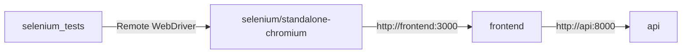

# Selenium WebDriver E2E Tests (Python pytest)

End-to-end tests for the workout app using **Selenium WebDriver**, **Python**, and **pytest**. Mirrors the Playwright suite in [`e2e/`](../e2e/) with the same 5 user flows.

## How this compares to other tests

| Suite | Location | Stack | What it tests |
|-------|----------|-------|---------------|
| API unit tests | `fastapi/tests/` | pytest + TestClient | FastAPI endpoints (no browser) |
| Playwright E2E | `e2e/` | JavaScript + Playwright | Full UI in browser |
| **Selenium E2E** | `selenium/` | Python + Selenium | Full UI in browser |

## Architecture



The browser runs inside the **Selenium Chrome container**. The pytest container connects via `SELENIUM_REMOTE_URL=http://selenium:4444/wd/hub`.

The app stack is shared with Playwright via [`docker-compose.e2e.yml`](../docker-compose.e2e.yml) (`api` + `frontend` with in-network API URL `http://api:8000`).

## Prerequisites

- [Docker Desktop](https://www.docker.com/products/docker-desktop/) running

## Run tests (Docker — recommended)

```bash
./selenium/run-docker.sh
```

Or from the repo root:

```bash
docker compose -f docker-compose.e2e.yml --env-file .env.e2e \
  --profile selenium run --rm --build selenium-tests
```

This starts `api`, `frontend`, `selenium`, runs pytest, then exits.

## Run tests (host — optional)

Requires the app on `localhost:3000` (e.g. `docker compose -f docker-compose.e2e.yml -f docker-compose.e2e.host.yml up`) and local Chrome + ChromeDriver:

```bash
cd selenium
pip install -r requirements.txt
pytest
```

Set `SELENIUM_REMOTE_URL` to use a local Selenium Grid instead of local Chrome.

## Test files

| File | Covers |
|------|--------|
| `tests/test_auth.py` | Register, login, logout |
| `tests/test_workout.py` | Create workout and routine |
| `helpers/auth.py` | Shared register/login helpers |
| `conftest.py` | WebDriver and `WebDriverWait` fixtures |

## Clean up Docker

```bash
docker compose -f docker-compose.e2e.yml down -v
```

## Troubleshooting

| Symptom | Likely cause | Fix |
|---------|--------------|-----|
| Session / browser crash | Shared memory too small | `shm_size: 2gb` on `selenium` service (already set) |
| `Connection refused` to frontend | App not healthy yet | Wait for frontend healthcheck; re-run |
| CORS / network errors on login | Wrong compose stack | Use `docker-compose.e2e.yml` (not dev `docker-compose.yml`) |
| Register clicks wrong button | Ambiguous submit | Tests scope to form via `#registerUsername` ancestor |

## Configuration

| Variable | Docker default | Purpose |
|----------|----------------|---------|
| `BASE_URL` | `http://frontend:3000` | App URL for pytest |
| `SELENIUM_REMOTE_URL` | `http://selenium:4444/wd/hub` | Remote WebDriver endpoint |
